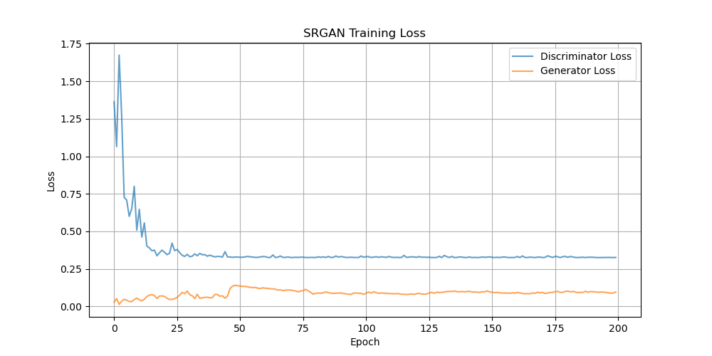

# Upgrading Custom Datasets Resolution

This repository implements Super-Resolution Generative Adversarial Networks (SRGAN and ESRGAN) using PyTorch. These models are designed to upscale low-resolution images to high-resolution versions, enhancing image quality for various applications like image restoration. Currently,
- **SRGAN** ✅ Completed
- **ESRGAN** ✅ Completed


## Project Overview

### What is SRGAN?

Super-Resolution Generative Adversarial Network (SRGAN) is a deep learning model that focuses on enhancing the resolution of low-resolution images. SRGAN operates with a **Generator-Discriminator** framework:
- **Generator**: Transforms low-resolution images into high-resolution ones, effectively predicting the fine details that are missing in the original image.
- **Discriminator**: Differentiates between real high-resolution images and the generated ones, providing feedback to the generator to improve its output.
- **Loss Functions**: SRGAN uses two types of loss functions:
  - **Perceptual Loss**: Ensures that the generated image retains realistic textures and high-level features similar to the original high-resolution image, measured through a VGG network.
  - **Adversarial Loss**: Encourages the generator to produce images that are indistinguishable from real high-resolution images.

SRGAN is particularly effective at recovering textures and enhancing image details, but may sometimes struggle with producing overly sharp or unrealistic results.

### What is ESRGAN?

Enhanced Super-Resolution Generative Adversarial Network (ESRGAN) is an improved version of SRGAN, offering several upgrades that enhance the model's performance:
- **Residual-in-Residual Dense Blocks (RRDB)**: ESRGAN replaces traditional batch normalization with RRDB, improving image sharpness, texture quality, and overall realism.
- **Relativistic Discriminator**: Unlike the traditional binary classifier used in SRGAN, the relativistic discriminator in ESRGAN estimates whether real images are more realistic than generated ones, improving training stability and generating more lifelike outputs.
- **Enhanced Perceptual Loss**: ESRGAN utilizes better feature maps to enhance texture recovery, leading to sharper and more accurate image upscaling.

These improvements make ESRGAN more robust and capable of producing higher-quality, more detailed images compared to SRGAN.

### SRGAN vs ESRGAN

| Feature                | SRGAN                                          | ESRGAN                                                   |
|------------------------|------------------------------------------------|----------------------------------------------------------|
| **Architecture**       | Basic GAN with residual blocks                 | RRDB-based architecture for better texture retention     |
| **Discriminator**      | Standard binary classifier                     | Relativistic GAN, improving training stability           |
| **Loss Functions**     | Content loss (VGG-based) + Adversarial loss    | Enhanced perceptual loss for better texture recovery     |
| **Output Quality**     | Decent enhancement with realistic textures     | Sharper, more detailed, and lifelike outputs             |
| **Training Stability** | May face instability in some cases             | Improved stability due to the relativistic discriminator |


## Project Structure

```
Upgrading-Custom-Datasets-Resolution/
│── assets/              # Stores various training visualizations, such as loss graphs and animated GIFs of generated images. You can monitor the model’s training progress here.
│── dataset/             # Contains your dataset (both low-resolution and high-resolution images). Ensure to adjust the `DATASET_DIR` path in `config.py` if you modify the folder name or structure.
│── debug/               # This folder stores sample images for debugging. It helps visualize the dataset’s content, such as pairing low-resolution and high-resolution images, to verify the data is processed correctly before training starts.
│── generated_images/    # Stores the output images generated by the model. This allows you to check the model's performance after each epoch or batch.
│── processed_images/    # Used to store intermediate or pre-processed images. This is useful if you are performing pre-processing steps on your images, like resizing or cropping.
│── logs/                # Used by TensorBoard to track the training progress in terms of loss values and other metrics. You can visualize these logs to better understand the model's behavior over time.
│── models/              # Contains checkpoints of the model’s state during training. You can save and load model weights from this directory to resume training or use a pre-trained model.
│── SRGAN/
│   ├── config.py        # Configuration file with settings and hyperparameters.
│   ├── dataset.py       # Dataset definitions.
│   ├── loss.py          # VGG-based loss functions.
│   ├── model.py         # Generator and Discriminator definitions.
│   ├── train.py         # Training loop setup.
│   ├── utils.py         # Utility functions for saving/loading models, logging, etc.
│── ESRGAN/              # 🚧 (Upcoming) ESRGAN implementation will be added here.
```


## Dataset Structure

```
dataset/
│── class_1/
│   ├── lr/  # Low-resolution images
│   ├── hr/  # Corresponding high-resolution images
│
│── class_2/
│   ├── lr/  # Low-resolution images
│   ├── hr/  # Corresponding high-resolution images
│
│── class_3/
│   ├── lr/  # Low-resolution images
│   ├── hr/  # Corresponding high-resolution images
```


## Installation:

Clone this repository to your local machine:
```
git clone https://github.com/cxycode32/Upgrading-Custom-Datasets-Resolution.git
cd Upgrading-Custom-Datasets-Resolution
```

Install the required dependencies:
```
pip install -r requirements.txt
```


## How to Run?

### Setup

1. Prepare your dataset then place it in the `dataset/` folder in the project root directory.
2. (Optional) You may change the folder name, you will also need to update the `DATASET_DIR` at `config.py`.
3. The configuration parameters (e.g., batch size, learning rate, image resolution) can be modified in `config.py`.

### Dataset Processing

1. The program automatically processes your dataset using `torchvision.transforms` to downscale it to low-resolution images and upscale to high-resolution images.
2. All processed images will be stored in the `processed_images/` folder.
3. (Optional) Likewise, you may change the folder name, you will also need to update the `PROCESSED_IMAGE_DIR` at `config.py`.

### Experimentation

You can experiment with different downscaling and upscaling algorithms to find out what works best for your dataset. The current setup uses default settings, but you are free to modify them in the `dataset.py` or experiment within the `train.py` file.

### Let's Start the Training

1. You can set `SAVE_MODEL` and `LOAD_MODEL` to `True` or `False` in `config.py` depending on your needs.
2. When `SAVE_MODEL` is set to `True`, your model will be saved inside the `models/` folder every 10 epochs.
3. When `LOAD_MODEL` is set to `True`, you may choose to load the model from which epoch.
4. Run the following command:
```
cd SRGAN
python train.py
```


## Visualization:

### Dataset Debugging
To visualize the low-resolution and high-resolution images from your dataset, you can use the `debug_dataset` function. This function will save sample pairs of images in the `debug/` folder. You can adjust the number of pairs to save by changing the `num` parameter.

Example usage:
```
debug_dataset(dataset, num=10)
```

### Training Loss Visualization
This helper function will visualize the losses of the discriminator and generator over training steps and save the plot in the `assets/` folder:

```
def plot_training_losses(disc_losses, gen_losses, save_dir=config.ASSETS_DIR, filename="training_loss.png"):
```



### Generated Images
To visualize the generated high-resolution images during training, use the following helper function. The images will be saved in the `generated_images/` folder:
```
def save_generated_image(fake, epoch, batch_idx, dir=config.GENERATED_IMAGE_DIR):
```

### Generated Images GIF
Create a GIF from the saved generated images in the `generated_images/` folder and save the GIF in the `assets/` folder:
```
def create_gif(save_dir=config.ASSETS_DIR, image_dir=config.GENERATED_IMAGE_DIR, filename="gan_training"):
```

### Tensorboard
You can track training progress and visualize the loss curves as well as generated images using TensorBoard. To log the losses and images, use the helper functions `log_metrics_to_tensorboard` and `log_images_to_tensorboard`:
All these are stored inside the `logs` folder.
```
def log_metrics_to_tensorboard(writer, disc_loss, gen_loss, step):
......

def log_images_to_tensorboard(writer, real_images, fake_images, step):
......
```

Run the following command:
```
tensorboard --logdir logs
```
After you've finished running the script. If you've changed your `LOG_DIR` at `config.py`, remember to replace `logs` in the command to whatever you've changed to.